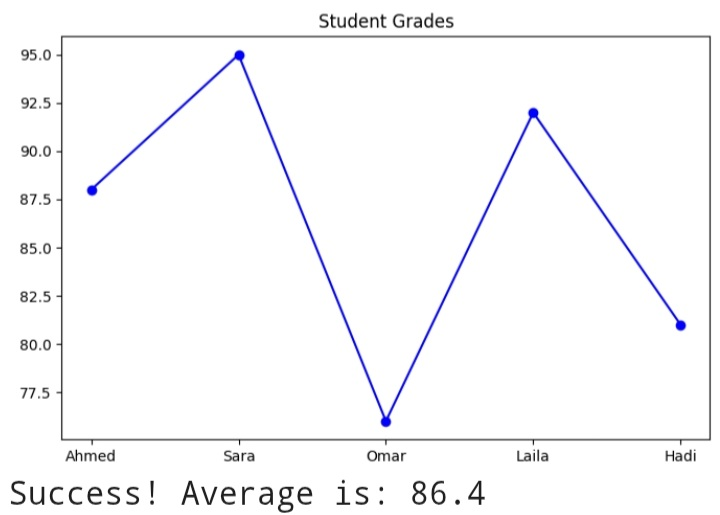

# Student Performance Analyzer (SPA)

A simple Python project that analyzes student grades, calculates statistics, and generates a plot.

## Features
- Reads student grade data from `data.csv`
- Calculates:
  - Average grade
  - Highest grade
  - Lowest grade
- Generates a plot of grades
- Saves results into `result.txt`

## Technologies Used
- Python
- pandas
- matplotlib

## How to Run
```bash
pip install pandas matplotlib
python main.py
```

## Author
Mohammed A. Alozeib
